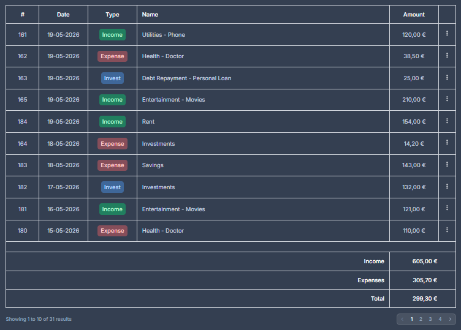

# Tables

## Transactions table



```php
<flux:table :paginate="$transactions" wire:loading.class="opacity-40">
    <flux:table.columns>
        <flux:table.column align="center" class="hidden w-20 pr-0 sm:table-cell">#</flux:table.column>
        <flux:table.column align="center" class="w-30">Date</flux:table.column>
        <flux:table.column align="center" class="w-30">Type</flux:table.column>
        <flux:table.column>Name</flux:table.column>
        <flux:table.column align="center" class="w-30">Amount</flux:table.column>
        <flux:table.column align="center" class="w-10 pr-0"></flux:table.column>
    </flux:table.columns>

    <flux:table.rows>
        @forelse ($transactions as $transaction)
            <flux:table.row>
                <flux:table.cell class="hidden w-20 pl-3! text-center sm:table-cell">
                    {{ $transaction->id }}
                </flux:table.cell>
                <flux:table.cell align="center">
                    {{ $transaction->date->format('d-m-Y') }}
                </flux:table.cell>
                <flux:table.cell align="center">
                    <flux:badge color="{{ $transaction->type->color() }}">
                        {{ $transaction->type }}
                    </flux:badge>
                </flux:table.cell>
                <flux:table.cell>
                    <a href="{{ route('transaction.show', $transaction) }}">
                        {{
                            $transaction->children?->name ??
                                ($transaction->category?->name !== 'Uncategorized'
                                    ? $transaction->category?->name
                                    : $transaction->title)
                        }}
                    </a>
                </flux:table.cell>
                <flux:table.cell align="center">
                    {{ Number::currency($transaction->amount, 'EUR', locale: 'el') }}
                </flux:table.cell>
                <flux:table.cell align="center" class="pr-3!">
                    <flux:dropdown position="bottom" align="end">
                        <flux:button icon-trailing="ellipsis-vertical" variant="ghost" size="xs" inset></flux:button>

                        <flux:menu>
                            <flux:menu.item href="{{ route('transaction.show', $transaction) }}" wire:navigate.hover icon="eye">View</flux:menu.item>
                            <flux:menu.item href="{{ route('transaction.edit', $transaction) }}" wire:navigate.hover icon="pencil">Edit</flux:menu.item>

                            <flux:menu.separator />

                            <flux:menu.item
                                wire:click="delete({{ $transaction->id }})"
                                wire:confirm="Are you sure?"
                                variant="danger"
                                icon="trash"
                            >
                                Delete
                            </flux:menu.item>
                        </flux:menu>
                    </flux:dropdown>
                </flux:table.cell>
            </flux:table.row>
        @empty
            <flux:table.row>
                {{-- Desktop --}}
                <flux:table.cell colspan="6" class="hidden text-center md:table-cell">No records found.</flux:table.cell>

                {{-- Mobile --}}
                <flux:table.cell colspan="5" class="text-center md:hidden">No records found.</flux:table.cell>
            </flux:table.row>
        @endforelse
    </flux:table.rows>

    <flux:table.row>
        {{-- Large screens --}}
        <flux:table.cell colspan="6" class="hidden md:table-cell"></flux:table.cell>

        {{-- Mobile screens --}}
        <flux:table.cell colspan="5" class="table-cell md:hidden"></flux:table.cell>
    </flux:table.row>

    <flux:table.row>
        {{-- Large / Mobile screen --}}
        <flux:table.cell variant="strong" colspan="4" class="hidden text-right md:table-cell">Income</flux:table.cell>
        <flux:table.cell variant="strong" colspan="3" class="table-cell text-right md:hidden">Income</flux:table.cell>

        <flux:table.cell variant="strong" align="center" colspan="2">{{ Number::currency($income, 'EUR', locale: 'el') }}</flux:table.cell>
    </flux:table.row>
    <flux:table.row>
        {{-- Large / Mobile screen --}}
        <flux:table.cell variant="strong" colspan="4" class="hidden text-right md:table-cell">Expenses</flux:table.cell>
        <flux:table.cell variant="strong" colspan="3" class="table-cell text-right md:hidden">Expenses</flux:table.cell>

        <flux:table.cell variant="strong" align="center" colspan="2">{{ Number::currency($expense, 'EUR', locale: 'el') }}</flux:table.cell>
    </flux:table.row>
    <flux:table.row>
        {{-- Large / Mobile screen --}}
        <flux:table.cell variant="strong" colspan="4" class="hidden text-right md:table-cell">Total</flux:table.cell>
        <flux:table.cell variant="strong" colspan="3" class="table-cell text-right md:hidden">Total</flux:table.cell>

        <flux:table.cell variant="strong" align="center" colspan="2">{{ Number::currency($sum, 'EUR', locale: 'el') }}</flux:table.cell>
    </flux:table.row>
</flux:table>
```
